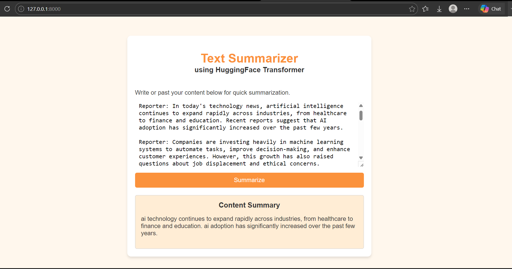

# Text Summarizer

An AI-powered web application that summarizes text using a trained T5 Transformer model and FastAPI.

## Features

- AI-based text summarization
- T5 Transformer model
- FastAPI backend
- Simple web interface

## Technologies Used

- Python
- FastAPI
- Uvicorn
- PyTorch
- Hugging Face Transformers
- HTML
- CSS

## Demo

## Installation

Install the required dependencies:

`pip install -r requirements.txt`

## Run the Application

`uvicorn app:app --reload`

Open the application:

http://127.0.0.1:8000
